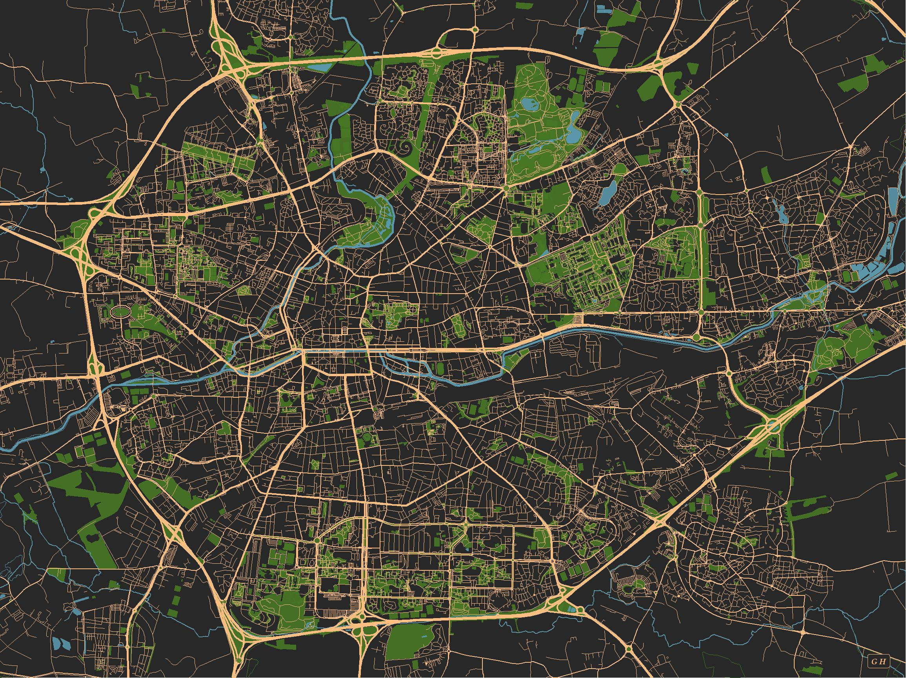

# Streetmaps

In this repository, I use [OpenStreetMap](https://www.openstreetmap.org/) and ggplot2 in R to create streetmaps. I was inspired by [this tutorial](https://ggplot2tutor.com/streetmaps/streetmaps/).

So far I have implemented maps of:

- [Rennes, FRANCE](docs/Rennes_4_3.jpg) (my hometown)
- [Mons-en-Barœul, FRANCE](docs/Mons.jpg)
- [Grenoble, FRANCE](docs/Grenoble.jpg)

The scripts to generate the maps are located in [`scripts/`](scripts/), helper functions in [`R/`](R/) and output files (images) in [`docs/`](docs/). I manage the computational environment using the [renv package](https://rstudio.github.io/renv/).

## Example: Rennes

NB: this image is in low definition for compression purpose.
